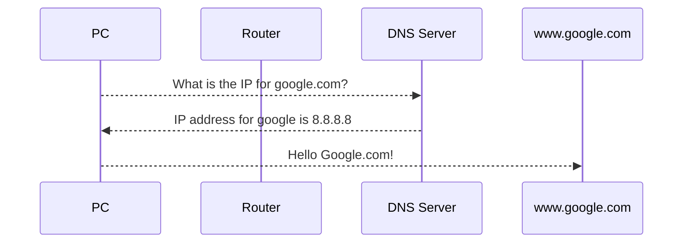

# Domain Name Services

- Resolves host-names to IP addresses
- By default runs on port 53

**DNS Resolution Process**

- DNS Caching: resolution results are stored locally so that this process doesn't have to happen every single time.

## DNS Records

- **Start of Authority (SOA)**
  - A record of information containing data on DNS zones and other DNS records.
  - A DNS zone is the part of a domain for which a DNS server is responsible for
  - Each zone contains a single SOA record

- **Name Server (NS)**
  - Stores information that identifies the name servers in the domain that store information for that domain

- **Service Locator (SRV)**
  - Used for newer protocols instead of creating a protocol-specific records like MX

- **Canonical Name (CNAME)**
  - Stored additional hostnames or aliases for hosts in the domain
  - CNAME records give a single computer multiple names (aliases)

- **Pointer (PTR)**
  - A pointer to another CNAME, used to do reverse DNS lookups (name is returned when given an IP address)

- **IPv6 Address (AAAA)**
  - Stores information for IPv6 addresses
  - Same as A records but for IPv6

- **IPv4 Address (A)**
  - Stores information for IPv4 addresses
  - Maps hostnames to an IP address

- **Text (TXT)**
  - Used to store information about SPF(Sender Policy Framework) and DKIM(DomainKeys Identified Mail)
  - Originally created to store human-readable text in the DNS record

- **Mail Exchange (MX)**
  - Stores information about where mail for the domain should be delivered to.

