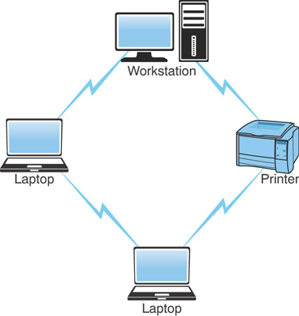

# Network Topologies

- **Topology** - refers to the network's physical and logical layout
  - ***physical*** - the actual layout of the network cables and network devices (hubs, switches, routers, firewalls, etc.)
  - ***logical*** - talks about the way in which the network appears to the devices that are using it

## Wired Topologies

- **Bus**
  - Uses a backbone to connect all the computers on the network
  - The ends of the physical bus need to be terminated to avoid signal reflection
  - A hub or switch is not needed in this type of topology
  - **Pros**
    - Cheap and easy to implement
    - Needs less cable
    - Doesn't need special network equipment
  - **Cons**
    - Network disruptions can happen easily
    - The backbone cable is a single point of failure
    - Hard to troubleshoot issues

    

- **Ring**
  - Data travels around the circle from one computer to another on the network
  - If a single computer or cable fails, the entire network comes down
  - Can be made fault-tolerant by using multiple rings
  - **Pros**
    - Cable failures are easily located so troubleshooting is easier
    - Easy to install
  - **Cons**
    - Network expansion can cause network disruption
    - A single cable failure can break bring down the entire network

    

- **Star**
  - All computers and network devices are connected to a central device (can be a hub or a switch)
  - This network can expand without risk of disruption to the rest of devices
  - A break in a single cable does not bring the network down
  - This network is the **easiest** one to expand
  - **Pros**
    - Easily expanded without risk of disruption
    - Cable failure will only affect a single device
    - Easy to troubleshoot and implement
  - **Cons**
    - This topology requires more cable than the others
    - Central device is a single point of failure
    - You need additional network equipment to create this layout (hub or switch)

    

- **Mesh**
  - Each computer on this network connects to **every** other computer
  - This gives us high level of ***redundancy**
  - If one cable breaks the data can find a different route to it's destination
  - **Pros**
    - Redundant paths between devices
    - Network can grow without risk of disruption
  - **Cons**
    - Requires way more cables
    - Complicated to implement

    

- **Hybrid**
  - Creates redundant connections only between specific devices (think servers)
  - These are often found in large network environments
  - **Pros**
    - Easy to troubleshoot
    - Flexible network topology
    - Scalable
  - **Cons**
    - Hard to design
    - Costly

    

## Wireless Topologies

- **Infrastructure Wireless Topologies**
  - Commonly used to extend a wired LAN to include wireless devices
  - Access Points (APs) act as a bride between a wireless and wired LAN

    

- **Ad Hoc Wireless**
  - Devices communicate directly without the use of APs

    

- **Wireless Mesh**
  - Each network node is interconnected to other nodes on the network
  - **Pros**
    - Self-healing - able to adapt to network failures
    - Scalable
    - Great reliability
  - **Cons**
    - Expensive
    - Complex

## Questions

1. Which network topology provides users with the greatest amount of fault tolerance?

    A. Star/hub-and-spoke   
    B. Ring  
    C. Mesh   
    D. Bus  

2. Which of these topologies allow for network expansion with the least risk of disruption?

    A. Bus  
    B. Ring  
    C. LAN  
    D. Star/hub-and-spoke    

3. Which network topology gives you the greatest redundancy but is expensive to implement?

    A. Wireless mesh    
    B. Wired mesh    
    C. Hybrid star    
    D. Bus network    

4. Which of these are true when it comes to a bus LAN network?  

    A. A single cable failing can cause the entire network to come down    
    B. All devices connect to a central device    
    C. It uses a single backbone to connect all network devices    
    D. Uses a dual-ring configuration    
