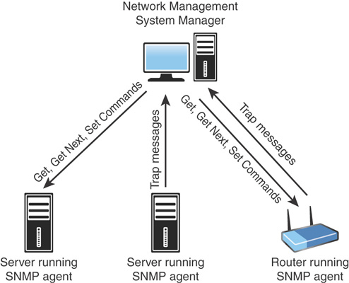

# Ports and Protocols

### Connection-Oriented vs Connectionless

- **Connection-Oriented**
  - Data delivery is guaranteed
  - Sending device re-sends any packet that the destination does not receive
  - Communication will continue until the transmission has been verified
  - Higher overhead and more demand on bandwidth

- **Connectionless**
  - Think best-effort delivery
  - The information is just sent but there is no confirmation that the data actually got there. Think send it and forget it approach
  - Less overhead than connection-oriented
  - Popular for things like streaming audio and video, because a few dropped packets is not a big deal

### Protocols

- [**Internet Protocol**](#IP)
  - Used to carry data from one node on the network to another
  - IP is connectionless
  - It is often combined with TCP (TCP/IP) to ensure transmission
  - Performs fragmentation and reassembly tasks

- [**Transmission Control Protocol**](#TCP)
  - Connection-oriented transport layer protocol
  - Provides reliability and things like flow control, sequencing, and error detection and correction
  - TCP guarantees delivery

  - **How TCP Works**
    - TCP connection process (TCP three-way handshake)
      1. PC1 sends a message called a SYN to PC2
      2. PC2 opens a connection for the request and sends back an acknowledgment message called an ACK (or SYN ACK)
      3. PC1 sends back another acknowledgment, saying that it has received the ACK message and that the session is ready to be used to send data back and forth
      4. Once the session is done, a similar process is used to close the session

- [**User Datagram Protocol**](#UDP)
    - A transport protocol but it does not guarantee delivery
    - UDP does not establish any kind of connection
    - Much lower overhead than TCP (TCP header has 14 fields vs UDP header has only 4)

- [**Internet Control Message Protocol**](#ICMP)
  - Works with the IP layer to provide things like error checking and reporting
  - Used by the ping utility
    - Sends out `echo requests` and gets `echo reply` back
  - Used for source quench
    - If the receiving host cannot handle the amount of incoming data at the rate that is being sent
    - To slow down the sending host, the receiver can send ICMP source quench messages, telling the sender to slow down

- [**IPSec**](#IPSec)
  - Provides secure communications between systems
  - An IP layer security protocol - can encrypt and authenticate transmissions
  - Operates at the network layer
  - Made up of two separate protocols:
    - *Authentication Header (AH)* - provides authentication and integrity checking for data packets
    - *Encapsulating Security Payload (ESP)* - provides encryption services
  - **Provides three security services**
    - **Data Verification** - verifies that data is received from the intended source
    - **Protection from data tampering** - makes sure data has not been tampered or changed in transit
    - **Private transactions** - makes sure that data in transit can't be read by other devices

- [**Generic Routing Encapsulation (GRE)**](#GRE)
  - Cisco-created tunneling protocol
  - Used to wrap data and securely send it across VPNs and Point-to-Point links

- [**File Transfer Protocol (FTP)**](#FTP)
  - Let's us upload and download files from a remote host that is running FTP software
  - Let's us also vide the contents of folders on an FTP server and do things like rename and delete files and directories
  - Has weak security mechanisms to authenticate users (There is an option for anonymous logons)
  - SFTP/SSH should be used instead of FTP
  - Uses ports 20 and 21

- [**Secure Shell**](#SSH)
  - Secure alternative to Telnet
  - Provides security because it encrypts data as it travels between systems
  - Has more robust authentication systems than Telnet
  - Two versions (these are incompatible)
    - SSH1 
    - SSH2 (more secure)
  - Runs on port 22 by default

- [**Secure File Transfer Protocol**](#SFTP)
  - Based on Secure Shell (SSH)
  - Provides better authentication between sender and receiver
  - Provides encryption capabilities
  - Uses port 22 for secure file transfers

- [**Telnet**](#Telnet)
  - A virtual terminal protocol
  - Enables sessions to be opened on a remote host, and then commands can be execute on the remote host
  - Operates on port 23
  - NOT SECURE

- [**Simple Mail Transfer Protocol**](#SMTP)
  - Protocol that handles how mail messages are sent between hosts
  - Relies on TCP connections to guarantee error free delivery
  - Default port used by SMTP is 25
  - Can be used to both send and receive mail

- [**Domain Name System**](#DNS)
  - Resolves host names to IP addresses
  - Operates on port 53 by default

- [**Dynamic Host Configuration Protocol (DHCP)**](#DHCP)
  - Enables ranges of IP addresses (predefined groups of addresses) defined on a system running a DHCP server application
  - Clients asks the server for an address and they are leased one
  - Runs on ports 67 and 68 by default

- [**Trivial File Transfer Protocol**](#TFTP)
  - Variation of FTP that does not have any security capabilities
  - Used for simple downloads, things like transferring firmware to a device like a router and booting diskless workstations
  - Does not offer directory navigation
  - Used UDP instead of TCP
  - Operates on port 69 by default

- [**Hypertext Transfer Protocol**](#HTTP)
  - Protocol that enables text, graphics, multimedia and other material to be downloaded from an HTTP server
  - Defines what actions can be requested by clients and how servers should answer those requests
  - HTTP runs over port 80 (considered insecure)
  - HTTPS runs over port 443 (has replaced HTTP)
  - Use uniform resource locator (URL) to decide what page should be downloaded from the remote server

- [**Network Time Protocol**](#NTP)
  -  Part of the TCP/IP protocol suite that communicates time between systems. 
  -  Think of this as the time keeper of the network, makes sure all devices have their clocks set to the same time
  -  Runs over UDP port 123

- [**Post Office Protocol Version 3 (POP3) / Internet Message Access Protocol Version 4 (IMAP4)**](#POP3)
  - Mechanisms for downloading, or pulling, email from a server
  - Needed because email must be stored in a central location and then downloaded from here
  - POP3 default port is 110 
  - IMAP4 default port is 143

- [**Simple Network Management Protocol (SNMP)**](#SNMP)
  - Uses port 161 to send data and port 162 to receive it
  - Enables network devices to communicate information about their state to a central system
  - The central system is also able to pass configuration parameters to the devices
  - **Components**
    - Central system (knows as a manager) acts as the central communication point for all the SNMP-enabled devices on the network 
    - On the managed devices, software called an SNMP agent is setup and configured with the manager's IP address 
    - The agent can communicate when certain events to the SNMP manager as they happen, these are called trap messages

  
